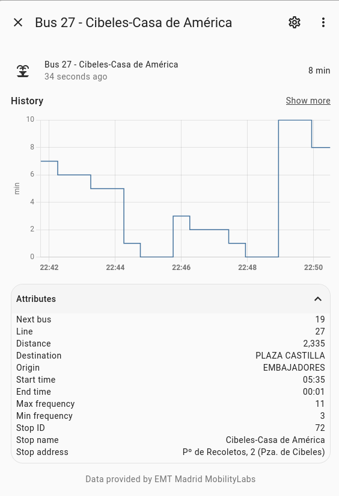

_Please :star: this repo if you find it useful_

# EMT Madrid bus platform for Home Assistant

This is a custom sensor for Home Assistant that allows you to have the waiting time for a specific Madrid-EMT bus stop. Each sensor will provide the arrival time for the next 2 buses of the line specified in the configuration.

Thanks to [EMT Madrid MobilityLabs](https://mobilitylabs.emtmadrid.es/) for providing the data and [documentation](https://apidocs.emtmadrid.es/).




## Prerequisites

To use the EMT Mobilitylabs API you need to register in their [website](https://mobilitylabs.emtmadrid.es/). You have to provide a valid email account and a password that will be used to configure the sensor. Once you are registered you will receive a confirmation email to activate your account. It will not work until you have completed all the steps.

## Manual Installation

1. Using the tool of choice open the directory for your HA configuration (where you find `configuration.yaml`).
2. If you do not have a `custom_components` directory there, you need to create it.
3. In the `custom_components` directory create a new directory called `emt_madrid`.
4. Download _all_ the files from the `custom_components/emt_madrid/` directory in this repository.
5. Place the files you downloaded in the new directory you created.
6. Restart Home Assistant
7. Add `emt_madrid` sensor to your `configuration.yaml` file:

   ```yaml
   # Example configuration.yaml entry
   sensor:
     - platform: emt_madrid
       email: !secret EMT_EMAIL
       password: !secret EMT_PASSWORD
       stop: 72
       lines: 
         - "27"
         - "N26"
       icon: "mdi:fountain"
   ```

### Configuration Variables

**email**:\
 _(string) (Required)_\
 Email account used to register in the EMT Madrid API.

**password**:\
 _(string) (Required)_\
 Password used to register in the EMT Madrid API.

**stop**:\
 _(integer) (Required)_\
 Bus stop ID.

**lines**:\
 _(list) (Optional)_\
 One or more line numbers.

**icon**:\
 _(string) (Optional)_\
 Icon to use in the frontend.
_Default value: "mdi:bus"_


## Sensors, status and attributes

Once you have the platform up and running, you will have one sensor per line specified. If no lines were provided, it'll create a sensor for each line in that stop ID. The name of the sensor will be automaticalle generated using the following structure: `Bus {line} - {stop_name}`.All the sensors will update the data automatically every minute and you should have the following data:

**state**:\
 _(int)_\
 Arrival time in minutes for the next bus. It will show "unknown" when there are no more buses coming and 45 when the arrival time is over 45 minutes.

### Attributes

**next_bus**:\
 _(int)_\
 Arrival time in minutes for the second bus. It will show "unknown" when there are no more buses coming and 45 when the arrival time is over 45 minutes.

**stop_id**:\
 _(int)_\
 Bus stop ID given in the configuration.

**stop_name**:\
 _(int)_\
 Bus stop name from EMT.

**stop_address**:\
 _(int)_\
 Bus stop address from EMT.

**line**:\
 _(int)_\
 Bus line.

**destination**:\
 _(int)_\
 Bus line last stop.

**origin**:\
 _(int)_\
 Bus line first stop.

**start_time**:\
 _(int)_\
 Time at which the first bus leaves the first stop.

**end_time**:\
 _(int)_\
 Time at which the last bus leaves the first stop.

**max_frequency**:\
 _(int)_\
 Maximum frequency for this line.

**min_frequency**:\
 _(int)_\
 Minimum frequency for this line.

**distance**:\
 _(int)_\
 Distance (in metres) from the next bus to the stop.


### Second bus sensor

If you want to have a specific sensor to show the arrival time for the second bus, you can add the following lines to your `configuration.yaml` file below the `emt_madrid` bus sensor. See the official Home Assistant [template sensor](https://www.home-assistant.io/integrations/template/) for more information.

```yaml
# Example configuration.yaml entry
template:
  - sensor:
      - name: "Siguiente bus 27"
        unit_of_measurement: "min"
        state: "{{ state_attr('sensor.bus_27_cibeles_casa_de_america', 'next_bus') }}"
```
