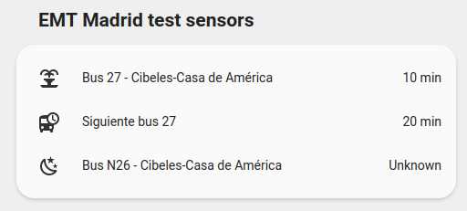

_Please :star: this repo if you find it useful_

# EMT Madrid bus platform for Home Assistant

This is a custom sensor for Home Assistant that allows you tu have the waiting time for a specific Madrid-EMT bus stop. Each sensor will provide the arrival time for the next 2 buses of the line specified in the configuration.

Thanks to [EMT Madrid MobilityLabs](https://mobilitylabs.emtmadrid.es/) for providing the data and [documentation](https://apidocs.emtmadrid.es/).



## Prerequisites

To use the EMT Mobilitylabs API you need to register in their [website](https://mobilitylabs.emtmadrid.es/). You have to provide a valid email account and a password that will be used to configure the sensor. Once you are registered you will receive a confirmation email to activate your account. It will not work until you have completed all the steps.

## Manual Installation

1. Using the tool of choice open the directory (folder) for your HA configuration (where you find `configuration.yaml`).
1. If you do not have a `custom_components` directory (folder) there, you need to create it.
1. In the `custom_components` directory (folder) create a new folder called `emt_madrid`.
1. Download _all_ the files from the `custom_components/emt_madrid/` directory (folder) in this repository.
1. Place the files you downloaded in the new directory (folder) you created.
1. Restart Home Assistant
1. Add `emt_madrid` sensor to your `configuration.yaml` file:

   ```yaml
   # Example configuration.yaml entry
   sensor:
     - platform: emt_madrid
       email: !secret EMT_EMAIL
       password: !secret EMT_PASSWORD
       stop: "72"
       line: "27"
       name: "Bus 27 en Cibeles"
       icon: "mdi:fountain"
   ```

### Configuration Variables

**email**:\
 _(string) (Required)_\
 Email account used to register in the EMT Madrid API.

**password**:\
 _(string) (Required)_\
 Password used to register in the EMT Madrid API.

**stop**:\
 _(string) (Required)_\
 Bus stop ID.

**line**:\
 _(string) (Required)_\
 Bus line that stops at the previous bus stop.

**name**:\
 _(string) (Optional)_\
 Name to use in the frontend.
_Default value: "Bus <bus_line> at <bus_stop>"_

**icon**:\
 _(string) (Optional)_\
 Icon to use in the frontend.
_Default value: "mdi:bus"_

## Sensor status and attributes

Once you have you sensor up and running it will update the data automatically every 30 seconds and you should have the following data:

**state**:\
 _(int)_\
 Arrival time in minutes for the next bus. It will show "-" when there are no more buses coming and 30 when the arrival time is over 30 minutes.

### Attributes

**later_bus**:\
 _(int)_\
 Arrival time in minutes for the second bus. It will show "-" when there are no more buses coming and 30 when the arrival time is over 30 minutes.

**bus_stop_id**:\
 _(int)_\
 Bus stop id given in the configuration.

**bus_line**:\
 _(int)_\
 Bus line given in the configuration.

### Second bus sensor

If you want to have a specific sensor to show the arrival time for the second bus, you can add the following lines to your `configuration.yaml` file below the `emt_madrid` bus sensor. See the official Home Assistant [template sensor](https://www.home-assistant.io/integrations/template/) for more information.

```yaml
# Example configuration.yaml entry
- platform: template
  sensors:
    siguiente_27:
      friendly_name: "Siguiente bus 27"
      unit_of_measurement: "min"
      value_template: "{{ state_attr('sensor.bus_27_en_cibeles', 'later_bus') }}"
```
